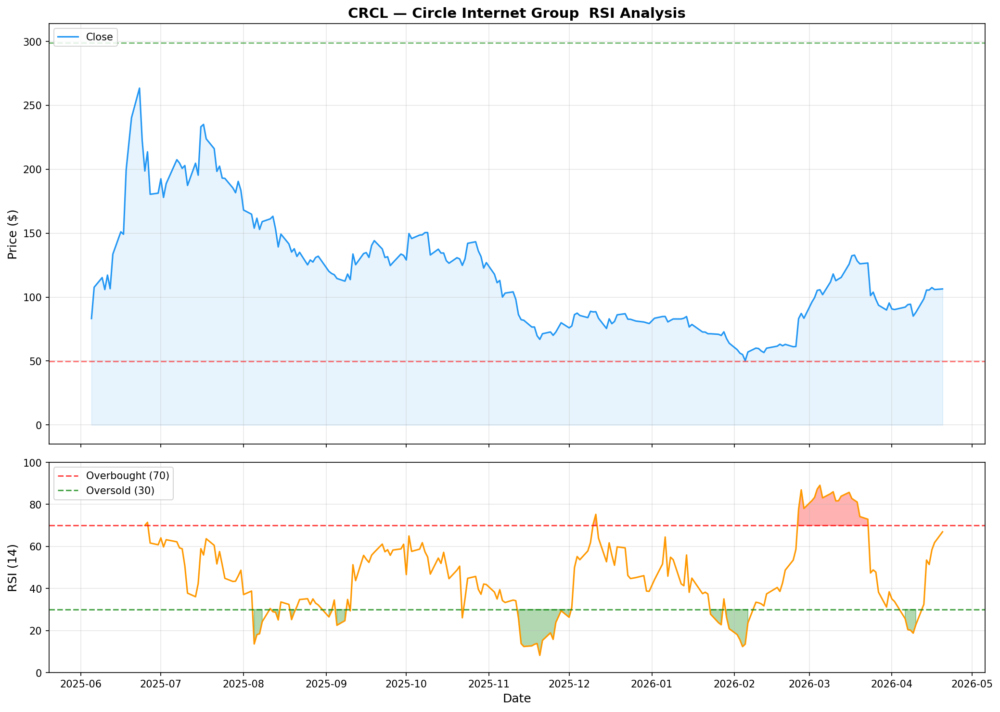

[← Back to Summary](../index.md)

# Circle Internet Group, Inc. (NYSE: CRCL)

**Sector:** Fintech | **Industry:** Stablecoin / Digital Payments | **Price:** $106.36 | **Market Cap:** ~$26.3B | **Last Updated:** 2026-04-21

---

## 1. COMPANY OVERVIEW

Circle Internet Group, Inc. (NYSE: CRCL) is one of the world’s leading internet financial platform companies. Founded in 2013 and headquartered in New York, Circle builds programmable blockchain infrastructure, digital assets, and payment applications designed to power a more open, global economy.

### Business Model & Revenue Segments

Circle operates three core platform layers:

1. **Arc Blockchain & Developer Infrastructure** — An open, enterprise-grade layer-1 blockchain purpose-built to bring real-world economic activity onchain. Arc testnet launched with 100+ participants (banking, capital markets, payments, technology) and has processed 166M+ transactions with near-100% uptime and half-second finality. Mainnet launch is planned for 2026.

2. **Circle Digital Assets & Services** — Anchored by USDC, the world’s second-largest stablecoin (~$75.3B in circulation, +72% YoY). Also includes EURC (€310M in circulation, +284% YoY), USYC ($1.5B assets, +111% QoQ after relaunch), and supporting mint, custody, and trust infrastructure.

3. **Circle Applications** — Circle Payments Network (CPN) for global money movement and StableFX for cross-border FX settlement. CPN has 55 financial institutions enrolled with annualized transaction volume of $5.7B.

### Revenue Composition

- **Reserve Income:** ~95.5% of total revenue ($733M in Q4’25, +69% YoY). This is interest earned on USDC reserves, which are backed by U.S. Treasury securities managed by BlackRock.
- **Other Revenue:** ~4.5% ($37M in Q4’25, +$34M YoY), comprising subscription/services and transaction fees.

### Competitive Moat

- **First-mover regulatory compliance:** Circle is the most regulatory-forward stablecoin issuer. It received conditional OCC approval for a national trust charter in December 2025 and was early to MiCA compliance in Europe.
- **BlackRock-managed reserves:** USDC reserves are held in the Circle Reserve Fund, managed by BlackRock, providing institutional-grade custody and transparency.
- **Network effects:** USDC is integrated across 15+ blockchains and used by Visa, Intuit, Polymarket, and the Government of Bermuda.
- **Coinbase partnership:** While the revenue share is a margin drag, the distribution through Coinbase (world’s largest U.S. crypto exchange) provides unmatched retail access.

### Management

- **Jeremy Allaire** — Co-Founder, CEO, and Chairman. A serial entrepreneur and prominent crypto policy advocate. Allaire has steered Circle since inception and is the public face of the company’s regulatory engagement.
- **Key concern:** Insiders maintain substantial voting control through supervoting shares, limiting outsider influence.

---

## 2. FINANCIAL ANALYSIS

### Income Statement Trends

| Metric | FY2025 | FY2024 | Change |
|--------|--------|--------|--------|
| Total Revenue & Reserve Income | $2.75B | $1.68B | +64% |
| Reserve Income | ~$2.62B | ~$1.55B | +69% |
| Other Revenue | ~$130M | ~$30M | +333% |
| Gross Margin (RLDC) | 39.4% | ~35% | +440 bps |
| Net Income (GAAP) | -$70M | +$157M | N/A |
| Adjusted EBITDA | $582M | $285M | +104% |
| Adjusted OpEx | ~$575M | ~$435M | +32% |

**Q4 2025 specifically:**
- Revenue: $770.2M (+77% YoY)
- Net Income: $133.4M (+$129M YoY)
- Adjusted EBITDA: $167M (+412% YoY)
- Basic EPS: $0.56

**Important note on FY2025 GAAP loss:** The $70M net loss was driven almost entirely by $424M in stock-based compensation triggered by IPO vesting conditions. On an adjusted basis, profitability is strong and improving.

### Balance Sheet Strength

- **Total Cash:** $1.53B
- **Total Debt/Equity:** 1.55% (essentially debt-free)
- **USDC Reserves:** ~$75.3B in highly liquid, Treasury-backed assets

### Cash Flow

- **Operating Cash Flow:** $542M (strong)
- **Levered Free Cash Flow (TTM):** -$91M (impacted by IPO-related costs and growth investments)
- **Adjusted FCF proxy:** Significantly positive when excluding SBC and one-time items

### Key Operating Indicators

- **USDC in Circulation:** $75.3B (+72% YoY)
- **Q4 Onchain Transaction Volume:** $11.9T (+247% YoY)
- **CPN Annualized TPV:** $5.7B

---

## 3. VALUATION

### Multiples vs Peers

| Metric | CRCL | Notes |
|--------|------|-------|
| Price / Sales (ttm) | ~9.5x | Premium but justified by growth |
| Forward P/E | ~102x | High, but reflects rapid earnings normalization |
| PEG Ratio | 4.34 | Rich; assumes sustained high growth |
| EV / Revenue | ~9.1x | Consistent with P/S |
| Price / Book | ~8x | Asset-light model |

Circle trades at a significant premium to traditional fintech or payment companies (e.g., PayPal ~2x P/S, Block ~2x P/S). However, direct stablecoin peers are scarce — Tether is private, and bank-issued stablecoins do not yet exist at scale. The premium reflects the scarcity value of a publicly traded, regulated stablecoin issuer with 70%+ revenue growth.

### Scenario Analysis

| Scenario | USDC Supply | Fed Funds Rate | Revenue (2027E) | Multiple | Target |
|----------|-------------|----------------|-----------------|----------|--------|
| **Bull** | $150B+ | 3.5–4.5% | $5.0B+ | 12–15x P/S | $160–200 |
| **Base** | $100B | 2.5–3.5% | $3.2B | 8–10x P/S | $120–150 |
| **Bear** | $60B | <2% | $1.5B | 5–7x P/S | $60–85 |

**Sensitivity:** Every 100 bps change in the Fed funds rate impacts Circle’s reserve income by roughly $750M annually (based on $75B supply). This is the single largest valuation driver.

### Analyst Consensus

- **Average Price Target:** $128.33 (implied ~20% upside)
- **Range:** $55 (low) to $280 (high)
- **20 analysts** covering; consensus rating is Buy
- **Recent changes:** Compass Point downgraded to Sell on 4/9/26 (PT $77); Wells Fargo lowered PT to $111 from $128

---

## 4. GROWTH CATALYSTS

1. **Arc Blockchain Mainnet Launch (2026)** — If Arc achieves adoption as an "Economic OS for the internet," it creates a new revenue stream (gas fees, validator economics) independent of interest rates.

2. **GENIUS Act Implementation** — Signed into law by President Trump in July 2025, the GENIUS Act establishes a federal regulatory framework for payment stablecoins. Circle’s early compliance posture positions it as a prime beneficiary. No issuer has yet received formal "permitted payment stablecoin issuer" status, but Circle is widely expected to be among the first.

3. **USDC Supply Growth** — USDC crossed $75B and is growing 70%+ annually. If the stablecoin total addressable market (TAM) reaches $1T+ by 2028, USDC could capture $200–300B (25–30% share).

4. **Circle Payments Network (CPN)** — With 55 institutions enrolled and $5.7B annualized TPV, CPN is moving from pilot to commercial scale. If CPN reaches $50B+ TPV, transaction fees could become a material revenue contributor.

5. **EURC & USYC Expansion** — EURC (+284% YoY) and USYC (+111% QoQ) diversify beyond USD. MiCA compliance in Europe is a tailwind for EURC adoption.

6. **Enterprise Partnerships** — Visa (USDC settlement), Intuit (multi-year integration), Polymarket (prediction market collateral), and Bermuda (national onchain economy) validate real-world utility.

7. **National Trust Charter** — OCC conditional approval (Dec 2025) strengthens USDC infrastructure and could reduce reliance on third-party banking partners.

8. **Q1 2026 Earnings (May 11, 2026)** — First full quarter post-IPO normalization. Investors expect continued profitability and guidance for FY2026.

---

## 5. RISK FACTORS

### Business Risks
- **Interest rate sensitivity:** 95%+ of revenue is reserve income tied to Fed policy. If rates fall below 2%, revenue would compress by 30–40%.
- **Single-product concentration:** USDC dominates revenue. Failure of USDC (depeg, regulatory action, loss of trust) would be catastrophic.
- **Coinbase revenue share:** Coinbase captures 100% of interest on its ~22% USDC share and 50% of interest on the remaining supply. This structural drag limits gross margins to ~40% rather than the ~80% typical of pure asset-management businesses.
- **Competition:** Tether (USDT) still holds ~70% of global stablecoin market cap. Bank-issued stablecoins (JPMorgan, etc.) could enter if regulations favor incumbents. Ethena (synthetic dollar) and other crypto-native alternatives are gaining traction.

### Financial Risks
- **GAAP profitability mask:** Adjusted EBITDA is strong, but GAAP earnings are distorted by massive SBC. Dilution from equity compensation is ongoing.
- **Valuation premium:** At ~9.5x P/S and 100x+ forward P/E, the stock prices in significant growth. Any miss on USDC supply or rates could trigger sharp multiple compression.

### Macro / Sector Risks
- **Regulatory reversal:** While the GENIUS Act is law, implementation rules (FinCEN, FDIC, SEC) are still being drafted. A restrictive interpretation could limit USDC utility or increase compliance costs.
- **Systemic shocks:** A major stablecoin depeg (even at a competitor) could trigger redemption surges and loss of confidence across the sector.
- **Cybersecurity:** As a custodian of $75B+ in reserves, Circle is a high-value target. A breach or operational failure could be existential.

---

## 6. TECHNICAL ANALYSIS

### RSI Analysis
- **Latest RSI (14-period):** 66.95 — approaching overbought territory (>70)
- **Trend:** RSI has surged from deeply oversold (~18.8 on April 9) to near-overbought in 11 sessions, reflecting a violent V-shaped recovery from the $85 lows.
- **Last 5 readings:** 53.53 → 51.42 → 58.37 → 61.82 → 66.95
- **Interpretation:** The rapid RSI ascent signals strong buying momentum, but also suggests the stock may be due for consolidation or a pullback before challenging higher resistance.

### Price Structure
- **All-Time High:** $298.99 (June 23, 2025 — days after IPO)
- **All-Time Low:** $49.90 (February 5, 2026)
- **52-Week Range:** $49.90 – $298.99
- **IPO Price:** $31.00 (June 5, 2025)
- **YTD Performance:** +35.51%
- **1-Year Performance:** +55.74%

### Key Levels
- **Support 1:** $100.00 (psychological round number, recent consolidation zone)
- **Support 2:** $85.00–$90.00 (April 2026 lows, critical floor)
- **Support 3:** $70.00 (February–March consolidation area)
- **Resistance 1:** $120.00 (analyst consensus target area, psychological)
- **Resistance 2:** $150.00 (prior support turned resistance from January 2026)
- **Resistance 3:** $200.00+ (requires significant fundamental re-rating)

### Volume & Moving Averages
- **Recent Volume:** ~11.3M (April 20) vs. 10-day average of ~12M — volume declining during the bounce, which can signal weakening momentum.
- **Moving Averages:** The stock recently reclaimed the 20-day moving average after trading below it for most of March. The 50-day MA sits near $110–$115 and is the next technical hurdle.

---

## 7. SENTIMENT & FLOWS

### Analyst Ratings
- **Consensus:** Buy (17–20 analysts)
- **Average Target:** $128.33 (+20.7% upside)
- **Low Target:** $55.00
- **High Target:** $280.00
- **Recent Actions:**
  - Compass Point: Downgraded to Sell (4/9/26), lowered PT to $77 from $79
  - Wells Fargo: Lowered PT to $111 from $128

### Short Interest
- CRCL short borrow fees are elevated relative to typical NYSE listings, reflecting scarcity of lendable shares and skepticism from some market participants. However, short interest as a percentage of float is moderate (exact figures unavailable due to data-source restrictions).

### Institutional Ownership
- As a recent IPO, institutional ownership is still building. Early filings indicate participation from growth-oriented funds and crypto-adjacent ETFs. Full 13F data will become more meaningful after the first few quarters as a public company.

### Insider Activity
- Insider Sentiment Score is currently low/normal per Yahoo Finance data. No major insider buying or selling clusters have been reported post-IPO lockup.

### Social Sentiment
- X/Twitter financial community sentiment is mixed-to-bullish. Crypto-native accounts are generally supportive of Circle’s regulatory-first approach, while traditional finance accounts debate the interest-rate sensitivity. The GENIUS Act signing generated significant positive discourse.
- Substack coverage has focused on the stablecoin legislative landscape, Circle’s premium valuation, and the Coinbase revenue-share overhang.

---

## 8. SUBSTACK & NEWS SCAN

### Recent Developments (April 2026)
- **SEC DeFi Safe Harbor Statement (April 14, 2026):** The SEC signaled openness to a regulatory safe harbor for decentralized finance protocols. This drove buying in CRCL ahead of earnings, as it reduces regulatory overhang for onchain dollar products.
- **Circle x Sasai Fintech (March 24, 2026):** Partnership to accelerate USDC adoption across Africa, expanding Circle’s geographic footprint.
- **Visa USDC Settlement (Feb 2026):** U.S. issuers and acquirers can now settle with Visa using USDC, enabling 24/7 settlement outside traditional banking hours.
- **Intuit Partnership:** Multi-year strategic agreement to integrate USDC across Intuit’s platform (QuickBooks, TurboTax ecosystem).

### Sector Trends
- **Stablecoin TAM growth:** The global stablecoin market cap has grown to ~$200B+, with USDC maintaining ~25% share. Bernstein and other research firms project the stablecoin market could reach $1T+ by 2028 if regulatory clarity persists.
- **Bank competition:** Several U.S. banks have announced stablecoin pilots. The GENIUS Act’s prohibition on non-financial companies issuing stablecoins (without special clearance) could actually benefit Circle by creating a regulated moat.
- **MiCA in Europe:** Circle was among the first issuers to receive MiCA compliance, giving EURC a first-mover advantage in the EU.

### Breaking News Watch
- Q1 2026 earnings scheduled for May 11, 2026. Key metrics to watch: USDC supply trajectory, reserve margin, other revenue growth, and FY2026 guidance.
- GENIUS Act rulemaking by FinCEN/FDIC/SEC is ongoing. Draft rules are expected in Q2/Q3 2026.
- Arc mainnet launch timing remains the key technical catalyst for 2026.

---

## 9. INVESTMENT THESIS

### Bull Case — Target: $160–200
**Drivers:**
- USDC supply grows to $150B+ by 2028, capturing 25–30% of a $500B+ stablecoin market.
- Fed funds rate stabilizes at 3.5–4.5%, keeping reserve income elevated.
- GENIUS Act implementation creates a regulated duopoly with Tether, favoring Circle’s compliance-first model.
- Arc mainnet launches successfully and generates gas fees / validator economics.
- CPN reaches $50B+ TPV, diversifying revenue beyond reserve income.
- New revenue streams (USYC, EURC, transaction fees) contribute 15–20% of revenue by 2028.

### Base Case — Target: $120–150
**Assumptions:**
- USDC supply grows to $100B+ by 2027.
- Interest rates stabilize at 2.5–3.5%.
- GENIUS Act is implemented without major restrictions.
- Coinbase revenue share remains stable at ~50% of non-Coinbase interest.
- Other revenue grows to 8–12% of total.
- Adjusted EBITDA margins expand to 25–30%.
- Stock trades at 8–10x forward revenue, compressing from current levels as growth normalizes.

### Bear Case — Target: $60–85
**Risks:**
- Fed funds rate falls below 2%, crushing reserve income.
- Bank-issued stablecoins capture 30%+ market share under favorable GENIUS Act rules.
- Coinbase renegotiates revenue share upward or launches a competing stablecoin.
- USDC loses share to Tether, Ethena, or other alternatives.
- Regulatory reversal or restrictive interpretation of the GENIUS Act.
- Arc fails to gain traction, and new revenue streams disappoint.
- Valuation compresses to 5–7x P/S on growth fears.

---

## 10. RECOMMENDATION

**Rating:** SPEC. BUY

Circle Internet Group offers a unique, hard-to-replicate exposure to the regulated stablecoin economy. The company has 70%+ revenue growth, improving adjusted profitability, dominant market position in compliant digital dollars, and powerful legislative tailwinds via the GENIUS Act. However, the stock carries significant uncertainty: extreme interest-rate sensitivity, a structural Coinbase revenue-share drag, single-product concentration, and a demanding valuation.

### Position Sizing
- **Aggressive growth portfolios:** Up to 5–7% position
- **Balanced portfolios:** 2–4% position
- **Conservative portfolios:** 1–2% speculative allocation or avoid

### Entry Strategy
- **Preferred entry:** $90–$100 (pullback to the April consolidation zone, RSI cools below 50)
- **Acceptable entry:** $100–$110 (current zone, if you believe Q1 earnings will surprise positively)
- **Aggressive entry:** Below $85 (only if fundamental thesis remains intact and the decline is technical)

### Stop Loss
- **Hard stop:** $75.00 (below the February–March support cluster)
- **Trailing stop:** 20% below entry price or below the 50-day moving average on a weekly close

### Key Levels to Watch
- **$120:** First resistance / analyst target cluster
- **$150:** Major psychological and prior support-turned-resistance
- **$85:** Critical support — a break below risks retesting $70–$75

### Catalyst Calendar
| Date | Event | Impact |
|------|-------|--------|
| May 11, 2026 | Q1 2026 Earnings | High — first normalized quarter post-IPO |
| Q2 2026 | GENIUS Act draft rules (expected) | High — regulatory clarity |
| 2026 | Arc mainnet launch | Medium-High — new revenue potential |
| Ongoing | Fed policy meetings | High — direct revenue impact |
| Q3 2026 | Q2 2026 Earnings & FY guidance | Medium — trajectory validation |

---

## 11. READABILITY & CLARITY PASS

- **Stablecoin:** A cryptocurrency designed to maintain a stable value, typically pegged 1:1 to a fiat currency like the U.S. dollar. USDC is backed by cash and short-dated U.S. Treasuries.
- **Reserve Income:** The interest Circle earns by investing the cash backing USDC in safe, short-term government securities. When people hold USDC, Circle invests the underlying dollars and keeps the interest.
- **RLDC Margin:** Revenue Less Distribution Costs margin. Circle’s version of gross margin after paying partners (primarily Coinbase) for distributing USDC.
- **Adjusted EBITDA:** Earnings before interest, taxes, depreciation, and amortization, excluding stock-based compensation and one-time items. A proxy for cash profitability.
- **Coinbase Revenue Share:** Coinbase distributes USDC to its users. In exchange, Coinbase receives 100% of the interest on USDC held in Coinbase wallets and 50% of interest on USDC held elsewhere.
- **GENIUS Act:** The "Guiding and Establishing National Innovation for U.S. Stablecoins Act" — the first federal law creating a licensing and regulatory framework for stablecoin issuers in the United States.
- **Arc Blockchain:** Circle’s own layer-1 blockchain network, designed for high-speed, low-cost financial transactions. Currently in testnet; mainnet expected in 2026.
- **CPN (Circle Payments Network):** A network for banks and payment providers to move money globally using stablecoins instead of traditional correspondent banking.
- **MiCA:** Markets in Crypto-Assets Regulation — the European Union’s comprehensive crypto regulatory framework.
- **TAM:** Total Addressable Market — the total revenue opportunity if Circle captured 100% of its target market.

---

## 12. SOURCES & REFERENCES

1. **Circle Q4 & FY2025 Earnings Release** — Circle pressroom, Feb 25, 2026. https://www.circle.com/pressroom/circle-reports-fourth-quarter-and-full-fiscal-year-2025-financial-results
2. **Circle IR — Quarterly Results** — investor.circle.com. https://investor.circle.com/financials/quarterly-results/default.aspx
3. **Yahoo Finance — CRCL Quote & Key Statistics** — finance.yahoo.com/quote/CRCL/. Data as of April 20, 2026. Price $106.36, market cap $26.3B, 52-week range $49.90–$298.99.
4. **CNBC — CRCL Key Stats** — cnbc.com/quotes/CRCL. Revenue (TTM) $2.747B, gross margin 39.43%, EPS (TTM) -$2.81.
5. **TradingView — CRCL Price History** — tradingview.com/symbols/NYSE-CRCL/. ATH $298.99 (June 23, 2025), ATL $49.90 (Feb 5, 2026).
6. **Yahoo Finance — Analyst Price Targets** — finance.yahoo.com/quote/CRCL/analysis/. 20 analysts, average target $128.33, range $55–$280.
7. **Public.com — CRCL Analyst Consensus** — public.com/stocks/crcl/forecast-price-target. 17 analysts, Buy consensus as of April 2026.
8. **TipRanks — CRCL Forecast** — tipranks.com/stocks/crcl/forecast. Wells Fargo lowered PT to $111 from $128; Compass Point downgraded to Sell (PT $77).
9. **Congress.gov — GENIUS Act (S.1582)** — congress.gov/bill/119th-congress/senate-bill/1582. Signed into law July 2025.
10. **Reuters — Understanding the GENIUS Act** — reuters.com/practical-law-the-journal/transactional/understanding-genius-act-2026-03-01/. Overview of licensing and regulatory framework.
11. **Wikipedia — GENIUS Act** — en.wikipedia.org/wiki/GENIUS_Act. Bipartisan legislation introduced by Sen. Bill Hagerty May 21, 2025.
12. **Paul Hastings — Crypto Policy Tracker** — paulhastings.com/insights/crypto-policy-tracker/white-house-releases-stablecoin-yield-report-genius-act-regulations-advance. FinCEN/OFAC proposed rules treating stablecoin issuers as financial institutions.
13. **Finviz — CRCL News** — finviz.com/quote.ashx?t=CRCL. SEC DeFi safe harbor statement drove buying ahead of earnings (April 14, 2026).
14. **Trefis — CRCL Data** — trefis.com/data/companies/CRCL. Circle x Sasai Fintech partnership announced March 24, 2026.
15. **Yahoo Finance — CRCL Earnings Call Highlights** — finance.yahoo.com/news/circle-internet-group-inc-crcl-190107241.html. Q4 2025 revenue $770M (+77% YoY), onchain volume $11.9T (+247% YoY).
16. **Simply Wall St — Q4 EPS Recovery** — simplywall.st/stocks/us/software/nyse-crcl/circle-internet-group/news/circle-internet-group-q4-eps-recovery-tests-bullish-profitab. Basic EPS $0.56 in Q4; FY2025 RLDC margin 39.4% exceeded guidance.
17. **Historical Option Data — CRCL Trading Analysis** — historicaloptiondata.com/crcl-trading-analysis-04-20-2026-0522-pm/. Operating cash flow $542M; 20 analyst opinions, mean target $128.33.
18. **Yahoo Finance — CRCL Full Time Employees** — 1,100 employees as of December 31, 2025.
19. **Stinson LLP — GENIUS Act Signed Into Law** — stinson.com/newsroom-publications-payment-stablecoin-regulatory-framework-established-as-genius-act-signed-into-law. Signed by President Trump, establishes regulatory framework.
20. **World Economic Forum — How will the GENIUS Act work** — weforum.org/stories/2025/07/stablecoin-regulation-genius-act/. Global coordination needed despite U.S. regulatory clarity.

---

*This research is for informational purposes only and does not constitute investment advice. Always conduct your own due diligence.*
