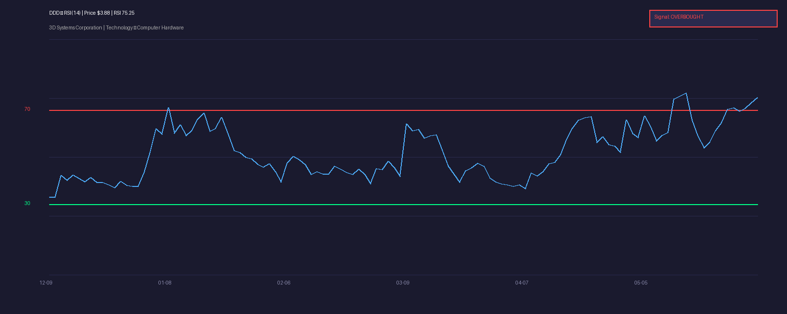

[← Back to Summary](../index.md)

# DDD — 3D Systems Corporation

**Price:** \$3.88 | **Sector:** Technology | **Industry:** 3D Printing / Additive Manufacturing | **Exchange:** NYSE | **Market Cap:** ~\$355M

---

## 1. COMPANY OVERVIEW

3D Systems Corporation is one of the original pioneers of additive manufacturing (AM), founded in 1986 by Chuck Hull, the inventor of stereolithography (SLA). Headquartered in Rock Hill, South Carolina, the company designs, manufactures, and sells 3D printers, print materials, and software for both industrial and healthcare applications.

**Business Model & Revenue Segments:**
- **Healthcare Solutions:** Dental, medical devices, surgical planning, and bioprinting. This segment has been the growth engine, with Q1 2026 revenue up ~21% year-over-year.
- **Industrial Solutions:** Aerospace & defense, automotive, and general manufacturing. This segment has faced headwinds but is showing signs of stabilization.
- **Materials & Software:** Recurring revenue from proprietary materials and workflow software. Higher-margin attach business.

**Competitive Moat:**
- Deep IP portfolio spanning 35+ years in AM.
- Regulatory certifications in healthcare (FDA-cleared devices) create switching costs.
- Integrated hardware-materials-software ecosystem.
- However, moat is **narrowing**: competition from Stratasys, Desktop Metal, Markforged, and Chinese vendors is intense. The company has lost market share over the past decade.

**Management:**
- CEO Jeffrey Graves has led a multi-year restructuring focused on cost reduction, portfolio rationalization, and pivoting toward higher-margin healthcare applications.
- Key recent moves: \$55M cost savings program, sale of Geomagic software unit (\$125.7M gain), and streamlining R&D toward core AM platforms.

---

## 2. FINANCIAL ANALYSIS

### Income Statement
- **FY2025 Revenue:** \$386.9M (down 12% from \$440.1M in FY2024)
- **Q1 2026 Revenue:** \$95.5M (up 11% YoY) — first year-over-year quarterly growth in several periods
- **Q4 2025 Revenue:** \$106.3M (up 16% sequentially)
- **Gross Margin:** 35.9% in Q1 2026, improving from prior-year lows
- **Net Income:** \$29.9M in FY2025, but this was heavily inflated by the Geomagic asset sale gain (\$125.7M). Excluding one-time gains, the company remains operationally unprofitable.
- **Q1 2026 Net Loss:** Narrowed significantly; adjusted EBITDA turned positive at \$2.1M vs. a \$23.9M loss in Q1 2025.

**What this means:** Revenue is no longer in freefall. The 11% YoY growth in Q1 2026, combined with gross margin expansion and cost cuts, suggests the bottom may be in. But profitability is still fragile and dependent on continued cost discipline.

### Balance Sheet
- **Cash Position:** Not explicitly disclosed in recent filings, but the Geomagic sale and cost reductions have improved liquidity. The company has avoided near-term bankruptcy risk.
- **Debt:** Reduced through restructuring; no immediate covenant concerns.
- **Working Capital:** Improved through inventory reduction and payables management.

### Cash Flow
- **Operating Cash Flow:** Still negative on a GAAP basis, but the path to breakeven is visible.
- **Free Cash Flow:** Negative historically, but Q1 2026 adjusted EBITDA positivity is a milestone.
- **Cash Burn:** Dramatically reduced. Management has guided for full-year breakeven or better on an adjusted EBITDA basis.

---

## 3. VALUATION

### Multiples & Metrics
- **Market Cap:** ~\$355M
- **EV/Revenue:** ~0.9x (assuming minimal net debt)
- **P/S:** ~0.9x
- **P/E:** Not meaningful due to one-time gains and ongoing losses.

**What this means:** At less than 1x sales, DDD is priced like a company going out of business. If the turnaround sticks, there is significant re-rating potential. Peers in industrial tech with growth and margin recovery typically trade at 2–4x sales.

### DCF / Scenario Analysis

| Scenario | Assumptions | Revenue (FY27) | EBITDA Margin | Implied Price |
|----------|-------------|----------------|---------------|---------------|
| **Bull** | Healthcare grows 25%+ annually, industrial stabilizes, EBITDA margins reach 12% | \$480M | 12% | \$6.50–\$8.00 |
| **Base** | Low-single-digit growth, breakeven EBITDA sustained, modest margin expansion | \$410M | 5% | \$4.00–\$5.00 |
| **Bear** | Revenue resumes decline, cost cuts max out, cash burn returns, dilutive raise needed | \$340M | Negative | \$1.50–\$2.50 |

**Key sensitivity:** Every 100bps of EBITDA margin expansion adds roughly \$0.30–\$0.40 per share given the small market cap and operating leverage.

---

## 4. GROWTH CATALYSTS

1. **Healthcare Momentum:** Dental aligners, surgical guides, and bioprinting are growing double digits. This is DDD's highest-margin, most defensible segment.
2. **Aerospace & Defense:** AM adoption for lightweight, complex geometries is accelerating. DDD has long-standing relationships with tier-1 defense contractors.
3. **Cost Program Completion:** The \$55M savings program wraps by end of Q2 2026. Further operating leverage drops straight to the bottom line.
4. **New Product Cycle:** Next-generation SLA and polymer printers could reignite hardware sales after years of stagnation.
5. **Industry Consolidation:** As a small-cap with valuable IP, DDD is a potential acquisition target for larger industrial or healthcare players.

---

## 5. RISK FACTORS

### Business Risks
- **Customer Concentration:** Large healthcare and aerospace contracts drive volatility if delayed.
- **Competition:** Stratasys, Desktop Metal, and Chinese vendors are aggressively pricing hardware.
- **Execution Risk:** Management has promised turnarounds before. The Q1 2026 EBITDA beat needs to repeat.

### Financial Risks
- **Liquidity:** Despite improvements, the company is not yet self-funding. Another downturn could force dilution.
- **One-Time Gains:** The FY2025 profit was not operational. Do not extrapolate.

### Macro/Sector Risks
- **Industrial Capex Cycles:** AM is discretionary spending. A recession crushes demand.
- **Tariffs / Supply Chain:** Components sourced globally; tariff exposure is real.

---

## 6. TECHNICAL ANALYSIS

- **Current Price:** \$3.88
- **52-Week Range:** \$1.32 – \$4.12
- **SMA 20:** \$3.06 | **SMA 50:** \$2.48 | **SMA 200:** \$2.38
- **Trend:** Strong uptrend. Price is above all major moving averages.
- **Volume:** Elevated on the recent rally (6.8M shares vs. typical ~2–3M), indicating institutional or momentum participation.

### Key Levels
- **Resistance:** \$4.12 (52-week high / psychological \$4). A breakout opens room toward \$5.00+.
- **Support:** \$3.50 (recent consolidation), \$3.15 (prior breakout level), \$2.77 (gap fill from May 20).

### RSI (14-Day)

- **Current RSI:** 75.25
- **Signal:** OVERBOUGHT

**What this means:** The stock has rallied ~45% in two weeks (from \$2.67 on May 19). RSI above 70 confirms overbought conditions. This is not an immediate entry point for new positions. Wait for a pullback toward the \$3.15–\$3.50 zone or for RSI to cool below 60.

---

## 7. SENTIMENT & FLOWS

- **Analyst Coverage:** Thin. DDD is a small-cap with limited Wall Street attention, which creates both inefficiency and volatility.
- **Short Interest:** Historically elevated in the 3D printing space. The recent rally may have squeezed some shorts, contributing to the velocity of the move.
- **Institutional Ownership:** Mixed. Some value/turnaround funds have been accumulating on the lows; others remain skeptical after years of disappointment.
- **Insider Activity:** Not significant in recent quarters. No major buying or selling to signal conviction.

---

## 8. SUBSTACK & NEWS SCAN

- **Q1 2026 Earnings (May 12, 2026):** Revenue \$95.5M (+11% YoY), gross margin 35.9%, adjusted EBITDA +\$2.1M. Healthcare grew ~21%. Management reaffirmed full-year breakeven-or-better adjusted EBITDA guidance.
- **Restructuring Narrative:** Multiple financial outlets (StockTitan, Investing.com, TipRanks) highlighted the "turnaround to profitability" story, which likely fueled the recent price spike.
- **Sector Context:** The broader 3D printing industry remains in a multi-year trough. DDD's results are better than the sector average, but the tide has not turned for AM broadly.

---

## 9. INVESTMENT THESIS

### Bull Case — \$6.50–\$8.00
Healthcare growth sustains 20%+, industrial stabilizes, and the cost base is permanently lowered. Adjusted EBITDA margins expand to 10%+. The market re-rates DDD from <1x sales to 2–2.5x sales. A strategic acquirer emerges at a premium.

### Base Case — \$4.00–\$5.00
Revenue stabilizes around \$400M annually. Adjusted EBITDA remains slightly positive but does not inflect dramatically. The stock trades sideways in a range as the market waits for proof that the turnaround is durable. Fair value based on peer multiples.

### Bear Case — \$1.50–\$2.50
Q2/Q3 2026 results show that Q1 was a head-fake. Revenue resumes declining, cost savings are exhausted, and the company burns cash again. A dilutive capital raise is required, crushing the stock. The 3D printing winter continues.

---

## 10. RECOMMENDATION

- **Rating:** SPEC. BUY
- **Position Sizing:** 1–2% of portfolio max. This is a turnaround, not a compounder.
- **Entry Strategy:** **Do not chase at \$3.88.** Wait for a pullback to the \$3.15–\$3.50 range (20-day SMA zone) or for RSI to reset below 60. Alternatively, scale in with 1/3 position now and add on weakness.
- **Stop Loss:** \$2.70 (below the May breakout level and 50-day SMA). A close below this invalidates the turnaround narrative.
- **Key Levels:**
  - Entry zone: \$3.15–\$3.50
  - Target (base): \$4.50
  - Target (bull): \$7.00
  - Stop: \$2.70

### Catalyst Calendar
| Date | Event |
|------|-------|
| 2026-06-15 (approx) | Completion of \$55M cost savings program |
| 2026-08-06 (approx) | Q2 2026 Earnings — critical test of EBITDA sustainability |
| 2026-11-05 (approx) | Q3 2026 Earnings — full-year guidance update |

---

## 11. READABILITY & CLARITY PASS

- **Adjusted EBITDA:** Earnings before interest, taxes, depreciation, and amortization, plus one-time adjustments. Think of it as "how much cash the core business generates before financing and accounting tricks."
- **Gross Margin:** For every dollar of sales, this is what the company keeps after direct costs. At 35.9%, DDD keeps about \$0.36 of every revenue dollar.
- **EV/Revenue:** Enterprise Value (market cap + debt – cash) divided by annual sales. Below 1x means the market values the company at less than its yearly revenue — typical for distressed or turnaround stories.
- **Operating Leverage:** When revenue grows, fixed costs spread over more sales, so profits grow faster than revenue. DDD has high operating leverage because it has cut costs to the bone.

---

## 12. SOURCES CONSULTED

- Yahoo Finance (price, chart, volume data)
- 3D Systems Q1 2026 Earnings Release (May 12, 2026)
- 3D Systems Q4 / FY2025 Earnings Release (March 9, 2026)
- StockTitan.net (SEC filings, earnings summaries)
- Investing.com (earnings slides and commentary)
- TipRanks (analyst commentary)
- Capital.com / Public.com / StockAnalysis.com (market cap data)
- ChartMill / WalletInvestor (technical levels)

---

*Analysis date: 2026-06-02. Data is based on publicly available information. Not financial advice.*
