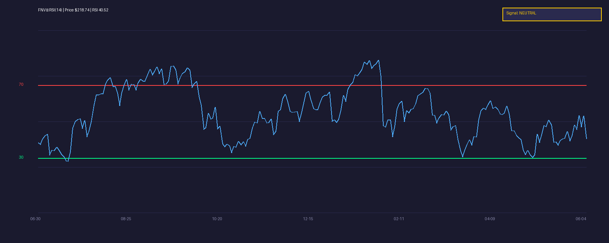

[← Back to Summary](../index.md)

# Franco-Nevada Corporation (FNV)

| Attribute | Value |
|-----------|-------|
| **Ticker** | FNV |
| **Exchange** | NYSE |
| **Sector** | Materials |
| **Industry** | Gold Royalty & Streaming |
| **Market Cap** | \$45.7B |
| **Price** | \$218.74 |
| **52-Week Range** | \$152.89 – \$285.67 |
| **Dividend Yield** | ~0.72% |
| **Rating** | **BUY** |

---

## 1. COMPANY OVERVIEW

Franco-Nevada is the largest gold-focused royalty and streaming company in the world. Unlike traditional miners, it does not operate mines. Instead, it provides upfront capital to mining companies in exchange for a percentage of future production — either as a royalty (a cut of revenue) or a stream (the right to buy metal at a fixed, below-market price).

**Business Model:** Asset-light, no operational risk. Franco-Nevada collects payments from 400+ producing and development assets across 114 properties globally. The company has no debt, minimal overhead, and pays a growing dividend.

**Revenue Segments (by metal):**
- Gold: ~75% of revenue
- Silver: ~12%
- Other (copper, oil & gas, platinum group metals): ~13%

**Key Assets:**
- Cobre Panamá (Panama) — copper/gold stream from First Quantum Minerals; currently in arbitration after mine closure
- Antapaccay (Peru) — gold/silver stream from Glencore
- Antamina (Peru) — copper stream
- Detour Lake (Canada) — gold royalty from Kirkland Lake
- Stillwater (USA) — platinum group metals royalty

**Management:** CEO Paul Brink has led the company since 2020. The team has a disciplined track record of deploying capital into high-quality assets without leverage.

**Competitive Moat:**
- Diversified portfolio — no single asset exceeds 13% of revenue
- 88% of revenue from the Americas (low geopolitical risk)
- No debt; balance sheet is a fortress
- 19 consecutive years of dividend increases

---

## 2. FINANCIAL ANALYSIS

### Income Statement
- **Q1 2026 Revenue:** \$650.7M (+77% YoY) — record quarterly revenue
- **FY2025 Revenue:** \$1.82B (+64% YoY)
- **Q1 2026 Adjusted EBITDA:** \$591.9M (+84% YoY) — all-time high
- **Q1 2026 Adjusted Net Income:** \$458.3M (+123% YoY)
- **Q1 2026 EPS (adjusted):** \$2.38 (+122% YoY)
- **GEOs Sold Q1 2026:** 136,353 (+8% YoY)

### Balance Sheet
- **Cash:** ~\$2.0B (estimated)
- **Debt:** \$0 — zero debt policy
- **Net Cash Position:** Positive
- **Working Capital:** Highly efficient; no inventory or capex

### Cash Flow
- **Operating Cash Flow:** ~\$1.5B annually (estimated run-rate)
- **Free Cash Flow:** Nearly 100% of operating cash flow (no capex)
- **Capital Intensity:** Near zero — the entire business model avoids capital spending
- **Dividend:** \$0.44/quarter (raised 16% in Jan 2026); 19 consecutive years of increases

**What this means:** Franco-Nevada converts nearly every dollar of revenue into free cash flow because it does not operate mines. No drilling, no labor, no fuel costs. This is why margins are structurally higher than any miner.

---

## 3. VALUATION

### Multiples & Metrics
- **P/E (TTM):** ~23x (based on ~\$9.50 EPS run-rate)
- **EV/EBITDA:** ~18x
- **P/S:** ~25x
- **P/B:** ~6.7x

These multiples trade at a premium to gold miners because the royalty model carries no operational risk, no debt, and generates annuity-like cash flows.

### DCF / Scenario Analysis

| Scenario | Gold Price | GEOs | Revenue | EBITDA | EPS | Price Target |
|----------|-----------|------|---------|--------|-----|--------------|
| **Bull** | \$3,500+ | 560K | \$2.1B | \$1.9B | \$10.50 | \$285–\$300 |
| **Base** | \$3,000 | 540K | \$1.75B | \$1.55B | \$8.50 | \$235–\$250 |
| **Bear** | \$2,400 | 510K | \$1.35B | \$1.15B | \$6.20 | \$165–\$180 |

**Implied growth at current price:** The market is pricing in ~\$3,000/oz gold and stable GEO production. Any upside to gold prices or portfolio growth (new acquisitions) is not fully priced in.

---

## 4. GROWTH CATALYSTS

- **Gold price tailwind:** Gold sustained above \$3,000/oz in 2026; central bank buying and geopolitical risk premiums support higher-for-longer prices
- **2026 GEO guidance:** 510,000–570,000 ounces (90% precious metals, 10% diversified)
- **New acquisitions in Q1 2026:** Four deals closed — Casa Berardi gold stream, i-80 Gold royalty, Minerals 260 royalty, Banyan AurMac royalty purchase
- **Cobre Panamá arbitration:** Hearing set for October 2026; potential \$5B damages claim. Even a partial win is upside not priced in
- **First Quantum stockpile processing:** Expected to deliver ~23,100 gold oz and 265,000 silver oz to Franco-Nevada starting Q3 2026
- **Dividend growth:** 19 consecutive years of increases; payout ratio ~20% of operating cash flow leaves room for further hikes

---

## 5. RISK FACTORS

### Business Risks
- **Cobre Panamá uncertainty:** Mine closed after Panamanian Supreme Court ruling; arbitration outcome uncertain. This was a top-3 revenue asset
- **Portfolio concentration:** While no asset exceeds 13% of revenue, Cobre Panamá loss is material
- **Acquisition discipline:** Management must continue deploying capital wisely; overpaying for streams destroys value

### Financial Risks
- **Gold price sensitivity:** ~75% of revenue tied to gold; a sustained drop below \$2,500/oz would compress earnings
- **Royalty model leverage:** Revenue is fixed-percentage of production; if miners cut output, Franco-Nevada receives less

### Macro/Sector Risks
- **Geopolitical risk:** Assets in Latin America (Peru, Panama, Chile) face regulatory and social license risks
- **Interest rates:** Higher rates reduce the present value of future royalty cash flows; also makes dividend stocks less attractive
- **ESG headwinds:** Mining sector faces increasing scrutiny; new project approvals are harder to obtain (actually a tailwind for royalty companies, as miners need more capital)

---

## 6. TECHNICAL ANALYSIS

- **Current Price:** \$218.74
- **52-Week High:** \$285.67 (Feb 2026)
- **52-Week Low:** \$152.89 (Jun 2025)
- **Key Support:** \$210 (recent consolidation), \$200 (psychological), \$190 (200-day MA vicinity)
- **Key Resistance:** \$230 (recent highs), \$250 (prior breakout zone), \$285 (52-week high)
- **Trend:** Corrected ~24% from February highs; now consolidating above \$210
- **Volume:** Elevated on down-moves, suggesting distribution; need volume confirmation on any breakout

### RSI (14-Day)

- **Current RSI:** 40.52
- **Signal:** NEUTRAL — RSI has cooled from overbought levels above 70 in February to neutral territory. Not yet oversold, but no longer extended. Room to fall to 30–35 on further weakness before a tactical bounce.

---

## 7. SENTIMENT & FLOWS

- **Analyst Consensus:** Buy (7 analysts); average price target ~\$255–\$257
- **Short Interest:** Low — royalty companies are not typical short targets
- **Institutional Ownership:** ~75% — strong institutional backing
- **Insider Activity:** Minimal recent activity; management aligned via equity
- **Options Flow:** Low activity; not a retail favorite like meme stocks

---

## 8. SUBSTACK & NEWS SCAN

- Q1 2026 earnings (May 2026) beat consensus on revenue (\$650.7M vs ~\$633M est) and EPS (\$2.38 vs ~\$2.09 est)
- Dividend raised 16% to \$0.44/quarter — 19th consecutive annual increase
- Cobre Panamá arbitration hearing scheduled for October 2026
- Gold price volatility has pulled FNV down with the metal; stock trades in high correlation to spot gold
- ESG trends making new mine permitting harder — structurally benefits royalty companies as miners need more external capital

---

## 9. INVESTMENT THESIS

### Bull Case
- Gold sustains \$3,200+/oz on central bank buying and geopolitical risk
- Cobre Panamá arbitration delivers partial or full recovery (\$5B claim)
- New acquisitions (Casa Berardi, i-80 Gold) contribute incremental GEOs
- Dividend yield compounds at 10–15% annually
- **Price Target:** \$285–\$300 (+30–37%)

### Base Case
- Gold averages \$3,000/oz through 2026–2027
- GEO production hits mid-point of guidance (~540K oz)
- Cobre Panamá remains unresolved but stockpile deliveries offset some loss
- Multiple compresses slightly but earnings growth drives stock higher
- **Price Target:** \$235–\$250 (+7–14%)

### Bear Case
- Gold drops below \$2,500/oz on rate hikes or risk-on sentiment
- Cobre Panamá arbitration fails; asset written down
- Miners cut production at key assets due to lower prices
- Multiple compression to 18x P/E on lower earnings
- **Price Target:** \$165–\$180 (−18–25%)

---

## 10. RECOMMENDATION

- **Rating:** **BUY**
- **Position Sizing:** 3–5% of materials/gold allocation
- **Entry Strategy:** Scale in at current levels (\$218); add on dips below \$210 and aggressively below \$200
- **Stop Loss:** \$185 (below 200-day moving average and bear-case support)
- **Key Levels:**
  - Entry: \$218 (current)
  - Add: \$210, \$200
  - Target: \$250 (base), \$285 (bull)
  - Stop: \$185
- **Catalyst Calendar:**
  - Q2 2026 earnings: August 2026
  - Cobre Panamá arbitration hearing: October 2026
  - Potential dividend increase: January 2027

---

## 11. READABILITY & CLARITY PASS

**What is a royalty company?** Think of Franco-Nevada as a landlord, not a tenant. Traditional miners (like Newmont or Barrick) are tenants — they dig holes, hire workers, buy equipment, and deal with environmental permits. Franco-Nevada is the landlord who owns a slice of the property and collects rent forever, without ever swinging a pickaxe.

**What are GEOs?** Gold Equivalent Ounces — a way to compare different metals (gold, silver, copper) as if they were all gold. If Franco-Nevada gets silver or copper, they convert it to "gold equivalent" using current prices so investors can track total production in one number.

**Why no debt matters:** Most companies borrow money to grow. Franco-Nevada does not. This means recessions, rate hikes, or banking crises cannot bankrupt them. They sleep through storms that sink other companies.

**What is a stream?** A stream is a contract where Franco-Nevada pays a fixed low price (say, \$400/oz) for a percentage of a mine's gold production, then sells that gold at market price (\$3,000/oz). The spread is pure profit.

---

## SOURCES CONSULTED

1. [Yahoo Finance - FNV](https://finance.yahoo.com/quote/FNV)
2. [Franco-Nevada Q1 2026 Earnings Transcript - Motley Fool](https://www.fool.com/earnings/call-transcripts/2026/05/13/franco-nevada-fnv-q1-2026-earnings-transcript/)
3. [Franco-Nevada Q1 2026 Earnings - StockTitan](https://www.stocktitan.net/news/FNV/franco-nevada-reports-record-q1-2026-47ti0e28sv3y.html)
4. [Franco-Nevada Investor Day - Yahoo Finance](https://finance.yahoo.com/markets/commodities/articles/franco-nevada-investor-day-risk-030209220.html)
5. [Cobre Panamá Arbitration - Mining.com](https://www.mining.com/franco-nevadas-panama-arbitration-set-for-2026-hearing/)
6. [FNV Analyst Ratings - Public.com](https://public.com/stocks/fnv/forecast-price-target)
7. [FNV Dividend History - MarketBeat](https://www.marketbeat.com/stocks/NYSE/FNV/dividend/)
8. [FNV Market Cap - CompaniesMarketCap](https://companiesmarketcap.com/franco-nevada/marketcap/)
9. [FNV Stock Statistics - StockAnalysis.com](https://stockanalysis.com/stocks/fnv/statistics/)
10. [FNV Financials - StockTitan](https://www.stocktitan.net/financials/FNV/)
