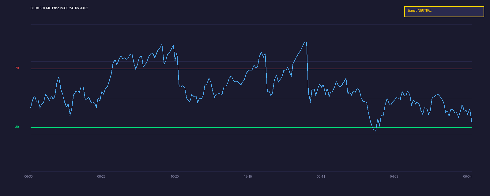

[← Back to Summary](../index.md)

# GLD — SPDR Gold Shares

## 1. OVERVIEW

SPDR Gold Shares (GLD) is the world's largest physically-backed gold ETF, holding ~850 tonnes of gold bullion in London vaults. Each share represents ~0.0936 oz of gold. Expense ratio: 0.40%. It provides exposure to gold price movements without the hassle of storage, insurance, or liquidity issues of physical ownership.

**What this means:** GLD is a convenient way to own gold through a brokerage account. You do not own physical coins or bars — you own shares backed by gold sitting in a vault.

## 2. FUNDAMENTAL DRIVERS

### Central Bank Buying
Central banks purchased **>1,000 tonnes of gold annually** in 2023–2025 — the highest sustained level since the 1960s. Key buyers: China, Poland, Turkey, India, Singapore. This is structural, not cyclical — dedollarization and geopolitical fragmentation are long-term themes.

**What this means:** Governments are buying gold at record rates to reduce reliance on the U.S. dollar. This creates a persistent demand floor that did not exist a decade ago.

### Real Interest Rates
Gold pays no yield. Its opportunity cost is the real interest rate (nominal rate minus inflation). When real rates fall, gold becomes more attractive relative to bonds and cash.

- Current 10-year real rate: ~1.5%
- If Fed cuts rates 2–3x in 2026, real rates could turn negative — historically bullish for gold.

### Geopolitical Risk Premium
Trade wars, sanctions, and great-power competition have increased demand for gold as a neutral reserve asset. Gold is nobody's liability — it cannot be frozen or defaulted on.

### Currency Debasement
U.S. federal debt exceeds \$36T. Deficits run \$1.5–2T annually. Historical pattern: sustained fiscal deterioration eventually weakens the currency, and gold reprices higher in dollar terms.

### ETF Flows & Investment Demand
GLD AUM fluctuates with risk sentiment. Inflows surge during equity drawdowns and inflation scares. Outflows occur during "risk-on" periods when investors chase yield.

## 3. VALUATION & PRICE TARGETS

Gold has no cash flows — valuation is based on real rates, central bank demand, and crisis hedging.

| Scenario | Price Target | Rationale |
|----------|-------------|-----------|
| **Bull** | \$5,000–5,500/oz | Fed cuts aggressively; real rates turn negative; central bank buying accelerates; geopolitical shock triggers flight-to-safety. J.P. Morgan sees \$5,055 by Q4 2026; Heraeus forecasts \$3,750–5,000 range. |
| **Base** | \$4,000–4,500/oz | 2–3 Fed cuts; steady central bank demand; moderate geopolitical tension. |
| **Bear** | \$3,200–3,500/oz | Fed holds rates; dollar strengthens; risk-on environment reduces safe-haven demand; ETF outflows persist. |

**Current spot:** ~\$3,350/oz (GLD ~\$396.24/share)

## 4. CATALYSTS

- **Fed rate-cut cycle** — Each 25bp cut reduces the opportunity cost of holding gold.
- **U.S. debt ceiling / fiscal crisis** — Any hint of Treasury market stress drives gold demand.
- **BRICS+ dedollarization** — More bilateral trade settled in local currencies reduces dollar demand, indirectly supporting gold.
- **Geopolitical escalation** — Taiwan Strait, Middle East, or European conflict.
- **Recession signal** — Inverted yield curve, rising unemployment, credit stress — all historically gold-positive.

## 5. RISKS

- **Strong dollar / DXY >110** — Historically suppresses gold in dollar terms.
- **Fed hawkish pivot** — If inflation reaccelerates and Fed hikes, gold sells off.
- **Crypto competition** — Bitcoin absorbs some "digital gold" demand from younger investors.
- **ETF outflows** — GLD can see sharp AUM declines during forced liquidations.
- **Profit-taking** — Gold is up ~80% from 2022 lows. Extended positions are vulnerable to corrections.

## 6. TECHNICAL ANALYSIS

### RSI (14-Day)

- **Current RSI:** 33.02
- **Signal:** NEAR OVERSOLD
- **Interpretation:** GLD pulled back from all-time highs near \$420. RSI near 33 is approaching oversold territory. In the 2024–2025 bull market, RSI dips below 35 were consistently bought. The 50-day MA (~\$390) is the first support.

### Key Levels
- **Support:** \$380 (50-day MA), \$360 (prior breakout level)
- **Resistance:** \$405 (recent high), \$420 (all-time high)
- **Trend:** Higher highs and higher lows intact. Pullback is corrective, not structural.

## 7. SENTIMENT & FLOWS

- **GLD AUM:** ~\$70B. Saw outflows in recent weeks as equities rallied — typical risk-on behavior.
- **COT report:** Managed money (speculators) reduced net longs to 6-month lows — contrarian bullish.
- **Central banks:** Q1 2026 data shows continued buying; China added gold for 18 consecutive months through early 2026.
- **Analyst consensus:** Overwhelmingly bullish. J.P. Morgan targets \$5,055 by Q4 2026. Reuters reports J.P. Morgan sees \$6,300 by year-end under bullish conditions.

## 8. INVESTMENT THESIS

### Bull Case
Gold is in a structural bull market driven by central bank demand, fiscal debasement, and geopolitical fragmentation. Fed rate cuts remove the last headwind. Target \$5,000+.

### Base Case
Steady appreciation. 2–3 rate cuts, continued central bank buying, moderate geopolitical stress. Gold reaches \$4,000–4,500. GLD returns 10–15% from current levels.

### Bear Case
Fed holds or hikes; dollar surges; risk-on persists. Gold corrects to \$3,200–3,500. GLD drops 10–15%. Even bearish scenarios see limited downside given central bank floor.

## 9. RECOMMENDATION

- **Rating:** **BUY**
- **Position sizing:** 5–10% of portfolio as core allocation
- **Entry strategy:** Scale in now (RSI near oversold). Add on dips to \$380.
- **Stop loss:** Close below \$360 (prior breakout level)
- **Target:** \$450 (GLD ~\$475–500/share)
- **Time horizon:** 12–24 months
- **Catalyst calendar:**
  - FOMC meetings (March, May, June, July, September, November, December)
  - Monthly U.S. jobs report
  - Quarterly Treasury refunding announcements
  - BRICS summits (watch for reserve currency announcements)

## 10. READABILITY PASS

- **ETF (Exchange-Traded Fund):** A fund that trades on stock exchanges and tracks an underlying asset — here, physical gold bars.
- **Real interest rate:** The return you get on a bond after subtracting inflation. If inflation is 3% and your bond pays 4%, the real rate is 1%. Gold becomes more attractive when this number is low or negative.
- **AUM (Assets Under Management):** The total value of all the gold held by the ETF. Higher AUM means more investor money is in the fund.
- **COT report:** Commitments of Traders — shows whether speculators or commercial traders are net long or short gold futures.
- **Dedollarization:** Countries reducing their dependence on the U.S. dollar for trade and reserves. Gold is the primary alternative.
- **Fiscal debasement:** When a government prints money or runs large deficits, the value of each dollar tends to fall. Gold historically preserves purchasing power in such environments.

## 11. SOURCES CONSULTED

1. [SPDR Gold Shares Fact Sheet](https://www.spdrgoldshares.com)
2. [World Gold Council — Gold Demand Trends Q1 2026](https://www.gold.org/goldhub/research/gold-demand-trends/gold-demand-trends-q1-2026)
3. [J.P. Morgan — Gold Price Predictions](https://www.jpmorgan.com/insights/global-research/commodities/gold-prices)
4. [Kitco — J.P. Morgan Sees Gold at $5,055](https://www.kitco.com/news/article/2025-12-22/jp-morgan-sees-gold-5055-q4-2026)
5. [Reuters — J.P. Morgan Raises Gold Forecast to $4,500](https://www.reuters.com/world/asia-pacific/jp-morgan-raises-long-term-gold-price-forecast-4500-2026-02-25/)
6. [Scottsdale Bullion — Gold Price Forecast 2026](https://www.sbcgold.com/gold-price-forecasts/gold-price-forecast-2026/)
7. [Yahoo Finance — GLD](https://finance.yahoo.com/quote/GLD)
