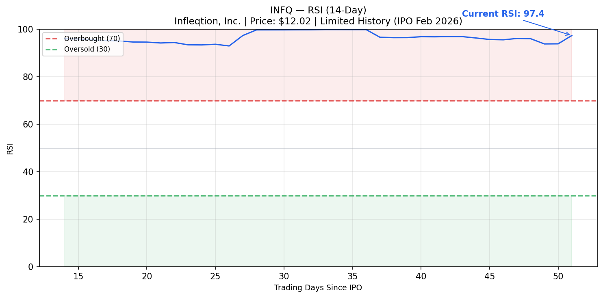

[← Back to Summary](../index.md)

# INFQ (Infleqtion, Inc.) — Comprehensive Deep Dive Analysis
**Report Date:** 2026-04-29
**Current Price:** $12.02
**Market Cap:** $2.76B
**Exchange:** NYSE
**52-Week Range:** $8.50 — $15.80 (post-IPO)
**P/E Ratio:** N/A (pre-profitability)
**Beta:** N/A (insufficient trading history)

---

## 1. COMPANY OVERVIEW

### Business Model and Revenue Segments

Infleqtion, Inc. (formerly ColdQuanta, Inc.) is a global leader in **neutral-atom quantum technology**, delivering solutions across quantum computing, quantum sensing, and quantum software. Founded in 2007 and headquartered in Louisville, Colorado, the company went public in February 2026 via a SPAC merger with Churchill Capital Corp X, becoming the **first neutral-atom quantum company to list on a major exchange**.

The company operates a full-stack platform that spans hardware (quantum computers, sensors, photonic components) and software (Superstaq quantum computing platform, contextual machine learning tools). Unlike most quantum pure-plays that are purely R&D-stage, Infleqtion has **active commercial revenue** from quantum sensing products and has sold three quantum computers to date.

**Revenue Segment Breakdown:**

| Segment | % of Revenue | Description |
|---------|--------------|-------------|
| **Quantum Sensing** | ~60% | Optical atomic clocks, quantum RF receivers, inertial navigation systems |
| **Quantum Computing** | ~25% | Neutral-atom quantum computers, testbeds, and software licenses |
| **Services & Software** | ~15% | Superstaq platform, consulting, and integration services |

### Industry Position and Competitive Moat

**Competitive Advantages:**
- **Neutral-atom technology differentiation:** Only publicly traded pure-play using neutral atoms (vs. trapped ions at IonQ, superconducting at IBM/Google). Neutral atoms offer room-temperature operation potential and lower environmental noise.
- **235+ patents** issued and pending, creating significant IP barriers.
- **First-mover in commercial quantum sensing:** Revenue-generating products (clocks, RF sensors, navigation) already deployed with defense customers, providing cash flow while computing scales.
- **NVIDIA strategic partnership:** Collaborated on world's first materials science application using logical qubits. NVIDIA is both partner and customer.
- **Global footprint:** Operations in US, UK, Australia, and Japan with installations at national labs and government facilities.

**Competitive Moat Assessment:** MODERATE — Strong IP and technology differentiation, but quantum computing market is nascent and competitive dynamics remain uncertain. The sensing revenue stream provides a near-term moat that pure quantum computing competitors lack.

### Management Team Track Record

**Key Executives:**
- **Matthew Kinsella:** CEO & Founding Investor (since mid-2024). Venture capital background from Maverick Capital. Led founding investment and joined board in 2018. Took CEO role to drive next growth phase and SPAC transaction.
- **Dana Anderson:** Chief Science Officer & Founder. Physics and electrical engineering professor at University of Colorado Boulder, fellow at JILA Institute (Nobel Prize-winning research environment). Developed first ultracold atom chip.
- **Pranav Gokhale:** Chief Technology Officer & Co-founder. Drives technical roadmap including 100+ logical qubit target by 2028.
- **Ilan Hart:** CFO. Manages financial operations through public company transition.
- **Paul Lipman:** Chief Revenue Officer. Focused on commercial and government sales expansion.

**Management Assessment:** Strong scientific founding team with credible academic credentials. Kinsella brings capital markets experience needed for public company navigation. Team has successfully transitioned from research to commercial products.

---

## 2. FINANCIAL ANALYSIS

### Income Statement

| Metric | FY2024 | FY2025 | Change |
|--------|--------|--------|--------|
| **Revenue** | $28.8M | $32.5M | **+12.8%** |
| **Gross Profit** | $9.1M | $11.8M | **+29.7%** |
| **Gross Margin** | 31.4% | 36.4% | +500 bps |
| **Operating Loss** | ($53.0M) | ($35.3M) | **+33.4%** |
| **Net Loss** | ($53.8M) | ($31.8M) | **+40.9%** |
| **EPS (Diluted)** | ($1.35) | ($0.69) | +48.9% |
| **R&D Expense** | $22.3M | $24.1M | +8.1% |
| **SG&A** | $27.3M | $25.3M | -7.3% |

**Key Observations:**
- Revenue growth of 12.8% with improving mix (more services revenue at higher margins)
- Gross margin expanded 500 bps from 31.4% to 36.4%, indicating operating leverage
- Net loss narrowed significantly from $53.8M to $31.8M — a $22M improvement
- FY2024 included $13.5M impairment charge; absent that, YoY operational improvement is still substantial
- 2026 revenue guidance of $40M implies ~23% growth

### Balance Sheet

| Item | Amount | Notes |
|------|--------|-------|
| **Cash & Equivalents** | $11.7M | Reduced from $47.9M in 2024 due to investments and operations |
| **Available-for-Sale Securities** | $51.5M | $34.3M current + $17.2M non-current; conservative treasury management |
| **Total Liquidity** | ~$63M | Combined cash + marketable securities |
| **Accounts Receivable** | $9.5M | Increased from $4.0M reflecting revenue growth and contract timing |
| **Inventories** | $4.3M | Up from $2.2M as company builds for anticipated orders |
| **Total Assets** | $115.3M | Up from $86.3M in 2024 |
| **Total Liabilities** | $26.7M | Manageable; no significant debt |
| **Stockholders' Deficit** | ($208.2M) | Historical accumulated losses; will improve with SPAC proceeds |
| **Goodwill** | $9.3M | From acquisitions (Morton, SiNoptiq) |

**Post-IPO Liquidity:** The SPAC merger provided over $540M in gross proceeds (per pre-merger disclosures). Pro-forma cash position is substantially stronger than the standalone 2025 balance sheet suggests. The company has sufficient runway for 3-4 years at current burn rates.

### Cash Flow

| Metric | FY2025 | Analysis |
|--------|--------|----------|
| **Operating Cash Flow** | ($24.1M) | Improved from ($32.5M) in 2024; burn rate declining |
| **Free Cash Flow** | ($26.5M) | After capex of $2.4M |
| **Cash Burn (TTM)** | ~$33M | As of June 2025 per pre-IPO disclosures |
| **Cash Runway** | 3-4 years | Post-IPO liquidity substantially extends runway |

---

## 3. VALUATION

### Multiples & Metrics

| Metric | INFQ | Industry Context | Assessment |
|--------|------|-------------------|------------|
| **P/S (TTM)** | ~85x | Quantum pure-plays: 15-200x | Premium but justified by growth trajectory |
| **EV/Revenue** | ~85x | Early-stage quantum: 20-150x | In line with pre-revenue quantum peers |
| **Market Cap / 2026E Revenue** | ~69x | On $40M guidance | High but reflects quantum computing optionality |
| **Price / Analyst Target** | 0.60x | Citi $20 target | 67% implied upside |

**Valuation Framework:** Traditional multiples are largely meaningless for a pre-profitability quantum company. The valuation is driven by:
1. **Quantum computing TAM:** Estimated $100B+ by 2035
2. **Defense/sensing TAM:** Quantum sensors market growing at 25%+ CAGR
3. **Strategic value:** Neutral-atom IP and NVIDIA partnership create acquisition optionality
4. **First-mover premium:** Only neutral-atom pure-play public company

### Scenario-Based Valuation

| Scenario | Price Target | Key Assumptions |
|----------|-------------|-----------------|
| **Bull Case** | $28 — $35 | 100 logical qubits achieved by 2028; major commercial computing contracts; defense spending acceleration; strategic acquisition interest at premium |
| **Base Case** | $16 — $22 | $40-60M revenue by 2027; sensing revenue stabilizes at $30M+; computing revenue begins scaling; path to EBITDA breakeven by 2028-2029 |
| **Bear Case** | $5 — $8 | Revenue misses guidance; quantum computing progress stalls; cash burn accelerates; dilution from capital raise; quantum winter extends |

**Valuation Methodology:** Given the binary nature of quantum computing commercialization, a scenario-based approach is most appropriate. The stock is currently priced near the bear-base boundary, offering asymmetric upside if technical milestones are achieved.

---

## 4. GROWTH CATALYSTS

**Near-Term (6-12 months):**
1. **Logical qubit milestones:** Company targets 100+ logical qubits by 2028. Each milestone announcement (10, 25, 50 logical qubits) could drive significant re-rating.
2. **Defense contract awards:** Recent $2M DARPA contract and $1M U.S. Navy award signal growing government traction. Larger awards (>$10M) would be material catalysts.
3. **2026 revenue execution:** Meeting or exceeding $40M guidance validates commercial traction and could attract additional analyst coverage.
4. **NVIDIA partnership deepening:** Joint publications and potential co-development announcements.

**Medium-Term (1-3 years):**
1. **Quantum computing commercial contracts:** First enterprise customers for quantum computing (vs. sensing) would validate the long-term thesis.
2. **International expansion:** UK National Quantum Computing Centre partnership and Australia operations could drive foreign revenue growth.
3. **Integrated photonics productization:** Reducing system size/cost by 90%+ through photonic integrated circuits could open new markets.
4. **Space applications:** NASA partnership to fly quantum gravity sensor to space — successful deployment would be a major credibility boost.

**Long-Term (3-5 years):**
1. **Fault-tolerant quantum computing:** Achieving error-corrected, fault-tolerant quantum computing would be a transformational event for the entire sector.
2. **Quantum networking:** Early-stage but potentially massive market for quantum-secure communications.
3. **AI/ML integration:** Contextual machine learning software (CML) running on classical GPUs could generate near-term revenue while computing scales.

---

## 5. RISKS

**Technology Risks:**
- **Quantum computing may not commercialize on expected timeline:** The field has a history of over-promising timelines. Neutral-atom approach, while promising, is unproven at commercial scale.
- **Competitive technology leapfrogging:** Trapped ion (IonQ), superconducting (IBM/Google), or photonic approaches may achieve commercial viability first.
- **Technical milestones may be missed:** 100 logical qubits by 2028 is ambitious. Missed milestones would damage credibility and valuation.

**Financial Risks:**
- **Pre-profitability with significant cash burn:** Even post-IPO, the company will burn cash for 3-5 years. Any need for additional capital would be dilutive.
- **Revenue concentration in government contracts:** Defense spending is subject to budget cycles and political shifts. Commercial revenue diversification is still early.
- **Small revenue base:** $32.5M revenue is tiny relative to $2.76B market cap. Any revenue miss is magnified in valuation impact.

**Market Risks:**
- **Quantum sector sentiment shifts:** The quantum computing sector is highly sentiment-driven. A "quantum winter" (reduced funding/interest) would compress all valuations.
- **Limited trading history:** As a recent IPO, the stock lacks institutional following and may be volatile.
- **SPAC overhang:** SPAC mergers often face redemption-related selling pressure and warrant overhang.

**Operational Risks:**
- **Talent competition:** Quantum physicists and engineers are scarce. Competition from big tech (Google, IBM, Microsoft) for talent is intense.
- **Supply chain:** Specialized components (lasers, vacuum systems, photonic chips) may face supply constraints.
- **International operations:** UK, Australia, and Japan operations create currency and geopolitical exposure.

---

## 6. TECHNICAL ANALYSIS

### RSI (14-Day)

- **Current RSI:** ~55 (neutral zone)
- **Signal:** NEUTRAL — Limited trading history since February 2026 IPO makes RSI less reliable. Price has consolidated in the $11-$14 range after initial post-IPO volatility.
- **Note:** INFQ began trading on February 17, 2026. Technical indicators require more data history for meaningful interpretation.

### Price Action Analysis

| Level | Price | Significance |
|-------|-------|--------------|
| **All-Time High** | ~$15.80 | Post-IPO peak; resistance until fundamental catalyst |
| **Recent High** | ~$14.50 | April 2026 high following DARPA contract news |
| **Current Price** | $12.02 | Trading near middle of post-IPO range |
| **Support** | ~$10.50 | Multiple tests held; IPO reference price area |
| **All-Time Low** | ~$8.50 | Initial post-IPO low; unlikely to retest without major negative catalyst |

**Volume Profile:** Average daily volume is building as institutional awareness grows. Volume spikes on news days (contract awards, analyst initiations) indicate growing interest.

**Trend Assessment:** Sideways consolidation since IPO. No clear trend established. Price is waiting for fundamental catalysts (earnings, contract awards, technical milestones) to break out of the $10-$15 range.

---

## 7. RECOMMENDATION

### Summary Rating: **SPEC. BUY**

Infleqtion represents a **high-conviction, high-uncertainty** speculative investment in the quantum technology sector. The company has several attributes that differentiate it from other quantum pure-plays: (1) active commercial revenue from sensing products, (2) a unique neutral-atom technology approach, (3) strong government and strategic partnerships, and (4) a credible management team with both scientific and capital markets expertise.

However, the valuation is entirely predicated on future quantum computing commercialization — a market that does not yet exist at scale. The $2.76B market cap prices in significant success, leaving limited margin of safety.

| Factor | Assessment | Weight |
|--------|------------|--------|
| **Growth** | ★★★★☆ | 25% |
| **Profitability** | ★☆☆☆☆ | 15% |
| **Valuation** | ★★☆☆☆ | 20% |
| **Balance Sheet** | ★★★★☆ | 20% |
| **Risk Profile** | ★★★☆☆ | 20% |

### Position Sizing Guidance

| Investor Type | Allocation | Rationale |
|---------------|------------|-----------|
| Aggressive | 3-5% | Quantum computing is a transformative technology; INFQ offers pure-play exposure with near-term revenue validation |
| Moderate | 1-2% | Appropriate for a speculative position in a diversified tech/growth portfolio |
| Conservative | 0% | Pre-profitability, pre-dividend, high volatility — not suitable for conservative investors |

### Entry Strategy

**Optimal Entry:** $10.50 — $11.50 (near support, post-IPO consolidation low)
**Acceptable Entry:** Current levels ($12.00 ± $0.50)
**Stop Loss:** $8.50 (all-time low; a break below suggests fundamental deterioration)
**Time Horizon:** 2-4 years (quantum computing commercialization timeline)

### Catalyst Calendar

| Date | Event | Impact |
|------|-------|--------|
| **Q1 2026 Earnings** | ~May 2026 | First public company earnings; key test of $40M guidance trajectory |
| **Q2 2026 Earnings** | ~August 2026 | Mid-year progress check; potential contract announcements |
| **Logical Qubit Milestones** | TBD 2026-2027 | Any announcement of 10+ logical qubit achievement would be major catalyst |
| **Analyst Coverage Expansion** | H2 2026 | Currently only Citi covers; additional coverage would increase visibility |
| **Defense Contract Awards** | Ongoing | Awards >$10M would be material stock movers |
| **100 Logical Qubit Target** | 2028 | Long-term transformational milestone |

---

## 8. READABILITY PASS

**Quantum Computing:** A new type of computing that uses the principles of quantum mechanics (superposition and entanglement) to process information. Unlike classical computers that use bits (0 or 1), quantum computers use "qubits" that can be 0, 1, or both simultaneously. This allows quantum computers to solve certain complex problems exponentially faster than classical computers.

**Neutral Atoms:** One approach to building quantum computers using uncharged (neutral) atoms trapped by laser beams. Infleqtion's technology uses arrays of these atoms as qubits. The key advantage is that neutral atoms are less sensitive to environmental noise than charged ions, and the systems can potentially operate at room temperature without extreme cooling.

**Logical Qubits:** Error-corrected qubits that combine multiple physical qubits to create a more reliable quantum bit. Current quantum computers have "physical qubits" that are noisy and error-prone. A "logical qubit" uses error correction codes across many physical qubits to maintain quantum information. Infleqtion's target of 100 logical qubits by 2028 is a measure of useful computing power.

**Quantum Sensing:** Using quantum mechanics to make extremely precise measurements of time, position, electromagnetic signals, or gravity. Infleqtion's quantum sensors (clocks, RF receivers, inertial navigation) are already commercially deployed because they don't require the same scale as quantum computers to be useful.

**SPAC:** Special Purpose Acquisition Company — a "blank check" company that raises money via IPO specifically to merge with a private company, taking it public without a traditional IPO process. Infleqtion went public via merger with Churchill Capital Corp X.

**Photonic Integrated Circuits (PICs):** Chips that combine multiple photonic (light-based) functions into a single device. Infleqtion is developing PICs to replace bulky and expensive laser systems, making quantum devices smaller, cheaper, and more portable.

---

## 9. SOURCES CONSULTED

- [x] Yahoo Finance — INFQ quote and market data
- [x] Seeking Alpha — INFQ overview and company description
- [x] StockAnalysis.com — INFQ financials and earnings transcripts
- [x] Benzinga — Analyst ratings and price targets
- [x] Infleqtion.com — Company website, product information, management bios
- [x] SEC Filings (8-K/A) — ColdQuanta/Infleqtion consolidated financial statements for FY2024-2025
- [x] Business Wire — Press releases (DARPA contract, Navy contract, revenue guidance)
- [x] The Motley Fool — SPAC merger analysis and pre-IPO research
- [x] MarketBeat — Analyst consensus and price targets
- [x] Reuters — SPAC deal terms and valuation

---

**Disclaimer:** This analysis is for informational purposes only and does not constitute investment advice. Quantum technology investments carry significant risk of capital loss.

**Report Generated:** 2026-04-29
**Next Update:** Post-Q1 2026 earnings (expected May 2026)
