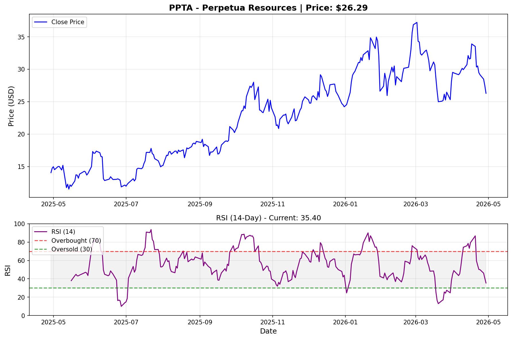

[← Back to Summary](../index.md)

# Perpetua Resources Corp. (PPTA) - Investment Deep Dive Analysis
**Date:** April 29, 2026
**Ticker:** PPTA (NASDAQ / TSX)
**Sector:** Materials — Precious Metals & Critical Minerals Mining
**Current Price:** $26.30 (as of April 29, 2026 close)
**Market Cap:** $3.29B
**Report Type:** Investment-Grade Deep Dive

---

## EXECUTIVE SUMMARY

Perpetua Resources is a development-stage mining company advancing the **Stibnite Gold Project** in central Idaho — a $1.3 billion open-pit gold and antimony mine that represents one of the largest and highest-grade undeveloped gold deposits in the United States. The project is also America's answer to China's antimony export bans, as it contains 148 million pounds of proven and probable antimony reserves, a critical mineral essential for defense systems, energy storage, and semiconductors.

The company broke ground in October 2025 after nine years of permitting, received final federal approval from the U.S. Forest Service, and is now in early works construction. Full production is targeted for H2 2029. The stock has rallied from $11.22 (52-week low) to $26.30, driven by construction commencement, $2B U.S. EXIM debt financing progress, and geopolitical tailwinds around critical minerals independence.

**Analyst Rating:** SPECULATIVE BUY (High Risk/High Reward)
**Price Targets:**
- **Bull Case:** $50.00 (+90%)
- **Base Case:** $35.00 (+33%)
- **Bear Case:** $15.00 (-43%)

---

## 1. COMPANY OVERVIEW

### 1.1 Business Model
Perpetua Resources is a mineral exploration and development company with a single transformative asset:

**Stibnite Gold Project (Idaho, USA)**
- **100% owned** open-pit gold and antimony project in Valley County, Idaho
- Proven and probable reserves: **6+ million ounces of gold** and **148 million pounds of antimony**
- Expected production: ~450,000 ounces of gold annually at full capacity
- One of the few known U.S. sources of antimony — a listed critical mineral
- Project footprint redesigned to shrink by 13% and improve stream/wetland conditions
- Brownfield site — restoring an abandoned legacy mining area

### 1.2 Strategic Importance
- **Antimony:** Essential for defense systems (armor-piercing ammunition, night vision), lead-acid batteries, flame retardants, and semiconductors
- China controls ~80% of global antimony supply and recently imposed export bans
- Stibnite is one of the largest antimony deposits outside China's control
- Fast-tracked by the Trump administration as part of U.S. critical minerals supply chain strengthening
- Designated a FAST-41 project (federal permitting acceleration)

### 1.3 Management
- **CEO Jon Cherry:** Led the company through the 9-year permitting process; former Midas Gold Corp. executive
- **Headquarters:** Boise, Idaho (close to the project)
- **Employees:** 47 (as of 2026)
- **Incorporated:** 2011 in British Columbia, Canada; formerly known as Midas Gold Corp. (renamed February 2021)

---

## 2. FINANCIAL ANALYSIS

### 2.1 Income Statement
Perpetua is pre-revenue and in the development/construction phase:

| Metric | FY2025 |
|--------|--------|
| Revenue | $0 (pre-revenue) |
| Net Loss | ~-$135M (estimated, development costs) |
| EPS (Diluted) | -$1.08 |
| R&D / Exploration | Minimal (focused on construction) |

### 2.2 Balance Sheet
| Metric | Value |
|--------|-------|
| Cash & Equivalents | ~$200M+ (post June/July 2025 equity raise) |
| Total Debt | Minimal (development financing pending) |
| Market Cap | $3.29B |
| Shares Outstanding | 125.1M |
| Book Value | Limited (development stage) |

**Key Financial Events:**
- **June/July 2025:** Equity offering raised $49M in gross proceeds (fully exercised underwriter option)
- **October 2025:** Posted $139M in construction phase financial assurance (reclamation bond)
- **Q1 2026:** Market value of non-affiliate equity: $868M (per 10-K filing)

### 2.3 Cash Flow
- **Operating Cash Flow:** Negative (pre-revenue)
- **Capital Expenditures:** ~$1.3B total project capex
- **Financing Strategy:**
  - U.S. EXIM Bank: Application for **$2.0 billion in debt financing** (Preliminary Project Letter and Indicative Term Sheet received September 2025)
  - Final EXIM Board review expected **Spring 2026**
  - Additional equity raises likely during construction

---

## 3. VALUATION

### 3.1 Comparative Analysis
As a pre-revenue development-stage miner, traditional multiples are not applicable. Valuation is based on:
- Net Asset Value (NAV) of reserves
- Comparable development-stage mining transactions
- Strategic premium for critical minerals exposure

| Comparable | Stage | Market Cap |
|------------|-------|------------|
| PPTA (Stibnite) | Construction | $3.29B |
| UAMY (US Antimony) | Exploration | ~$200M |
| Americas Gold (Galena) | Production | ~$500M |

### 3.2 NAV Analysis
- **Gold reserves:** 6M+ oz at ~$3,000/oz spot = $18B+ in-situ value
- **Antimony reserves:** 148M lbs (strategic premium applies)
- **Recovery rates, capex, opex** must be applied for realistic NAV
- Analyst consensus implies ~$35/share NAV at full production

### 3.3 Price Target Scenarios

| Scenario | Target | Implied Return | Key Assumptions |
|----------|--------|----------------|-----------------|
| **Bull** | $50 | +90% | EXIM financing closes at favorable terms; gold >$3,200; antimony prices spike on supply constraints; construction on schedule; additional strategic partnerships |
| **Base** | $35 | +33% | EXIM financing closes Q2 2026; gold $3,000; construction progresses with minor delays; first production H2 2029; equity dilution ~15% |
| **Bear** | $15 | -43% | EXIM financing delayed/cancelled; significant cost overruns; gold <$2,600; permitting challenges; major equity dilution required |

---

## 4. GROWTH CATALYSTS

### Near-Term (2026)
1. **EXIM Board Approval (Spring 2026):** $2B debt financing decision — the most critical catalyst
2. **Full Construction Sanction:** Expected Spring 2026 upon financing completion
3. **Equipment Agreements:** Long-lead time procurement advancing
4. **Exploration Resumption:** High-priority targets within approved Plan of Operations

### Medium-Term (2027-2029)
5. **Construction Milestones:** Mill construction, tailings facility, infrastructure
6. **First Gold Pour:** Targeted H2 2029
7. **Antimony Production:** Strategic offtake agreements with defense/industrial buyers
8. **Resource Expansion:** 28,536-acre land package offers exploration upside

### Strategic Tailwinds
- **U.S. critical minerals policy:** Bipartisan support for domestic supply chains
- **China antimony export controls:** Creates urgent demand for non-Chinese sources
- **Gold price environment:** $3,000+ spot price supports project economics
- **Defense prioritization:** Antimony classified as essential for national security

---

## 5. RISKS

### 5.1 Financing Risk (HIGH)
- **$2B EXIM financing is not guaranteed.** If delayed or denied, alternative financing may be more expensive or dilutive
- Total project cost ~$1.3B; financing gap could require significant equity raises
- Interest rate environment affects debt servicing costs

### 5.2 Execution Risk (HIGH)
- **First mine development:** Company has no operating history
- Construction complexity: open-pit mining, processing plant, tailings management
- Cost overruns common in mining (industry average 20-40% above feasibility estimates)
- Labor and equipment availability in remote Idaho location

### 5.3 Commodity Price Risk (MEDIUM)
- Gold price volatility affects project economics and valuation
- Antimony market is small and illiquid — price discovery challenges
- No hedging program currently in place

### 5.4 Regulatory/Environmental Risk (MEDIUM)
- **Nine years of permitting** demonstrates regulatory scrutiny
- Environmental opposition possible (Idaho conservation groups)
- Water rights, endangered species, and watershed protection issues
- Post-construction compliance and reclamation obligations

### 5.5 Dilution Risk (MEDIUM)
- Pre-revenue company requiring ongoing capital
- Multiple equity raises likely before first production (2029)
- Current shareholders could face 15-30% dilution

---

## 6. TECHNICAL ANALYSIS

### 6.1 Price Action
- **Current Price:** $26.30
- **52-Week Range:** $11.22 – $37.37
- **YTD Performance:** ~+40% (estimated)
- **Beta:** 0.72 (lower volatility than typical mining stocks)

### 6.2 Key Levels
| Level | Price | Significance |
|-------|-------|------------|
| Resistance 1 | $30.00 | Psychological round number |
| Resistance 2 | $37.37 | 52-week high |
| Support 1 | $24.00 | Recent consolidation area |
| Support 2 | $20.00 | Major psychological support |
| Support 3 | $15.00 | Pre-construction breakout level |

### RSI (14-Day)

- **Current RSI:** 35.40
- **Signal:** NEAR OVERSOLD — RSI approaching the 30 oversold threshold, suggesting potential buying opportunity if fundamentals remain intact
- The recent pullback from $37 highs to $26 has cooled momentum, creating a more attractive entry for patient investors

### 6.3 Trend Analysis
- **Primary Trend:** Bullish (higher highs and higher lows since 2024)
- **Recent Correction:** -30% from 52-week high — normal consolidation after rapid rally
- **Volume:** Elevated on down days, suggesting some profit-taking but not panic selling

---

## 7. RECOMMENDATION

### Rating: SPECULATIVE BUY

**Position Sizing:** 2-3% of portfolio maximum (high-risk development stage)

**Entry Strategy:**
- **Aggressive entry:** Current levels ($26-27) — RSI near oversold, strong fundamentals
- **Conservative entry:** Wait for EXIM financing confirmation (Spring 2026) — may miss upside but reduces financing risk
- **Dollar-cost averaging:** Scale in over 2-3 tranches given volatility

**Stop Loss:** $18.00 (below major support, -31% from current)
- Rationale: If price breaks $18, market is pricing in significant financing/execution concerns

**Catalyst Calendar:**
| Date | Event | Impact |
|------|-------|--------|
| Spring 2026 | EXIM Board Decision | CRITICAL |
| Summer 2026 | Full Construction Sanction | HIGH |
| 2027-2028 | Construction Milestones | MEDIUM |
| H2 2029 | First Production | HIGH |

---

## 8. READABILITY PASS

**Antimony:** A silvery-gray metal used in flame retardants, batteries, and military applications. China dominates global supply, making U.S. sources strategically valuable.

**Proven and Probable Reserves:** The amount of mineral that geologists have measured and can reasonably expect to extract economically. "Proven" = highest confidence; "Probable" = slightly less certain.

**FAST-41:** A U.S. federal program that speeds up permitting for infrastructure projects deemed nationally important.

**U.S. EXIM Bank:** The Export-Import Bank of the United States provides loans and guarantees to support American exports and strategic projects.

**Reclamation Bond:** Money set aside upfront to restore the land after mining ends — ensures environmental cleanup is funded.

**Brownfield:** A site that was previously mined or industrialized (vs. "greenfield" = untouched land). Stibnite is a brownfield site, meaning Perpetua is cleaning up old mining damage while building new operations.

---

## 9. SOURCES CONSULTED

1. [Yahoo Finance - PPTA](https://finance.yahoo.com/quote/PPTA/)
2. [Perpetua Resources Investor Relations](https://www.investors.perpetuaresources.com/)
3. [SEC EDGAR - PPTA 10-K Annual Report (FY2025)](https://www.sec.gov/cgi-bin/browse-edgar?action=getcompany&CIK=PPTA)
4. [Mining.com - Perpetua Starts Building $1.3B Stibnite Mine](https://www.mining.com/perpetua-starts-building-1-3b-stibnite-gold-antimony-mine/)
5. [PR Newswire - Groundbreaking Announcement](https://www.prnewswire.com/news-releases/perpetua-resources-breaks-ground-on-the-stibnite-gold-project-302590660.html)
6. [StockAnalysis.com - PPTA Overview](https://stockanalysis.com/stocks/ppta/)
7. [WallStreetZen - PPTA Forecast](https://www.wallstreetzen.com/stocks/us/nasdaq/ppta)
8. [MarketBeat - PPTA Analyst Ratings](https://www.marketbeat.com/stocks/NASDAQ/PPTA/forecast/)
9. [CNN Markets - PPTA](https://www.cnn.com/markets/stocks/PPTA)
10. [Performance.gov - Stibnite Permitting Dashboard](https://www.permits.performance.gov/permitting-project/fast-41-transparency-projects/stibnite-gold-project)

---

*Disclaimer: This analysis is for informational purposes only and does not constitute financial advice. PPTA is a high-risk, development-stage investment. The author may hold positions in securities mentioned. Always conduct your own due diligence before investing.*
