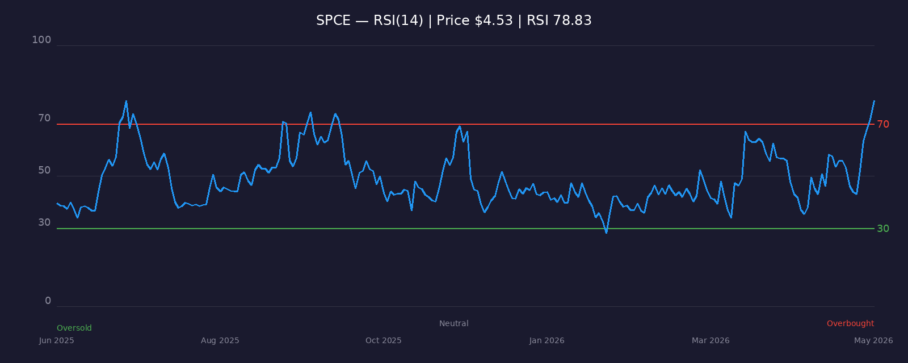

[← Back to Summary](../index.md)

# SPCE — Virgin Galactic Holdings

**Sector:** Space | **Exchange:** NYSE | **Price:** \$4.53 | **Last Updated:** 2026-05-29

---

## 1. COMPANY OVERVIEW

Virgin Galactic Holdings (NYSE: SPCE) is a vertically integrated aerospace company developing commercial human spaceflight for private individuals and researchers. Founded by Sir Richard Branson and headquartered in Orange County, California, the company operates the only FAA-licensed spaceline with a proven air-launch system.

**Business Model:**
- **Commercial Spaceflight:** Suborbital flights to the edge of space (~80 km altitude) for private astronauts, selling seats at ~\$450,000 each.
- **Research Missions:** Microgravity research payloads for government and private customers.
- **Future Fleet Services:** Planned high-frequency operations with next-generation Delta-class space vehicles.

**Fleet & Operations:**
- Current fleet: VSS Unity (retiring) and carrier aircraft VMS Eve.
- **Delta-class program:** Two new SpaceShips under development. First vehicle progressing to ground test phase in April 2026; flight test phase begins Q3 2026. Commercial operations with first new SpaceShip targeted for Q4 2026. Second vehicle expected between late Q4 2026 and early Q1 2027.
- The company paused commercial flights in 2024–2025 to focus resources on Delta-class development.

**Management:**
- CEO Michael Colglazier (former Disney Parks executive) leads operations.
- Founder Richard Branson remains a significant shareholder and brand ambassador.
- The company has undergone significant restructuring, including a December 2025 capital realignment that reduced contractual debt obligations by \$142 million.

---

## 2. FINANCIAL ANALYSIS

### Income Statement
- **FY2025 Revenue:** \$1.54 million (down from ~\$7M in 2024) — essentially zero flight revenue due to operational pause.
- **FY2025 Net Loss:** \$278.9 million (consistent with prior years of heavy losses).
- **Q4 2025 EPS:** -\$0.98 (beat analyst estimate of -\$1.09 by 10%).
- **Gross Margins:** Negative — no meaningful revenue to cover fixed costs.
- **Operating Margins:** Deeply negative; the company is entirely pre-revenue from an operational standpoint.

### Balance Sheet
- **Cash & Marketable Securities:** \$338 million as of December 31, 2025.
- **Debt:** Reduced via December 2025 restructuring; \$142 million in contractual obligations eliminated.
- **Liquidity:** The company raised \$122 million in late 2025 to bolster the balance sheet.
- **Runway:** At the guided Q1 2026 cash burn of \$90–95 million, current cash provides roughly 3–4 quarters of runway before additional capital is needed.

### Cash Flow
- **FY2025 Free Cash Flow:** -\$438 million (improved from deeper prior-year burns but still severe).
- **Q1 2026 Guidance:** Free cash flow of -\$90 to -\$95 million.
- **Capital Intensity:** Heavy. Q3 2025 capex alone was ~\$51 million; nine-month capex ~\$156 million, primarily for Delta-class development.
- **Path to Positive Cash Flow:** Depends entirely on successful Delta-class commercialization and achieving the guided \$450 million annual revenue at scale.

**What this means:** Virgin Galactic is burning through roughly \$90–100 million per quarter with almost no revenue. The \$338 million cash balance is a lifeline, but without successful Delta-class flights by late 2026, the company faces another dilutive capital raise or worse.

---

## 3. VALUATION

### Multiples & Metrics
- **Market Cap:** ~\$2.1 billion (at \$4.53/share with ~463 million shares outstanding).
- **P/S Ratio:** N/A — no meaningful revenue.
- **P/B Ratio:** ~4.5x — elevated for a pre-revenue company with negative equity trends.
- **EV/Revenue:** N/A.
- **Analyst Consensus Price Target:** \$3.06–\$3.66 (sources: StockAnalysis, TipRanks) — implying 15–20% downside from current levels.

### DCF / Scenario Analysis
Given the binary nature of the Delta-class program, a traditional DCF is less useful than scenario-based valuation:

| Scenario | Probability | Assumptions | Implied Price |
|----------|-------------|-------------|---------------|
| **Bull** | 20% | Delta-class launches on schedule in Q4 2026; fleet expands to 2 ships by mid-2027; achieves \$450M revenue run-rate by 2028; margins reach 20%+ EBITDA | **\$12–\$16** |
| **Base** | 40% | First Delta-class flight slips to early 2027; 1 ship operational through 2027; modest revenue of \$50–100M; additional capital raise dilutes 15–20% | **\$3–\$5** |
| **Bear** | 40% | Delta-class delays or technical failures; cash runs low by Q4 2026; dilutive raise at distressed terms or strategic alternatives explored | **\$1–\$2** |

**What this means:** The stock is essentially a call option on the Delta-class program. At \$4.53, you're paying a premium for a 20% chance of a 3–4x return, balanced against a 40% chance of 50–75% downside.

---

## 4. GROWTH CATALYSTS

1. **Delta-class Ground Tests (April 2026):** First new SpaceShip enters ground test phase — a critical milestone validating the manufacturing and assembly process.
2. **Flight Test Phase (Q3 2026):** If ground tests succeed, powered flight tests begin. This will be heavily scrutinized by investors and media.
3. **Commercial Service Resumption (Q4 2026):** First paying passengers on Delta-class would validate the business model and generate the first meaningful revenue in over two years.
4. **Second Ship Entry (Late 2026 / Early 2027):** Doubling fleet capacity would enable the guided \$450 million annual revenue target.
5. **Research Contracts:** NASA and other government microgravity research contracts could provide non-tourism revenue streams.

---

## 5. RISK FACTORS

### Business Risks
- **Program Execution Risk:** Delta-class is unproven in flight. Any anomaly, delay, or accident would be catastrophic for sentiment and funding.
- **Customer Concentration:** The private astronaut market is small and price-sensitive. A \$450K ticket is discretionary spending vulnerable to economic downturns.
- **Competition:** Blue Origin (New Shepard) offers similar suborbital experiences and has resumed crewed flights. SpaceX offers orbital tourism at a higher price point but with a more proven vehicle.

### Financial Risks
- **Funding Runway:** At current burn rates, cash runs critically low by late 2026 without revenue or additional financing.
- **Dilution Risk:** The December 2025 restructuring and prior raises have significantly diluted shareholders. Further raises are likely if Delta-class slips.
- **Debt Covenants:** While the December restructuring reduced obligations, any new debt may carry restrictive terms.

### Macro/Sector Risks
- **Regulatory:** FAA licensing requirements could delay commercial operations.
- **Reputational:** A high-profile accident in the commercial space tourism industry (even at a competitor) could dampen demand across the sector.
- **Economic Sensitivity:** Luxury discretionary spending contracts sharply in recessions.

---

## 6. TECHNICAL ANALYSIS

- **Current Price:** \$4.53 (as of 2026-05-28).
- **52-Week Range:** ~\$1.80 – \$4.85.
- **Trend:** Strong uptrend since early 2026; stock has more than doubled from lows.
- **Key Resistance:** \$4.85 (52-week high) — a break above could open a move toward \$6–\$7.
- **Key Support:** \$3.50 (recent consolidation zone), then \$2.80 (200-day moving average area).
- **Volume:** Elevated on up-days, suggesting accumulation ahead of Delta-class milestones.

### RSI (14-Day)

- **Current RSI:** 78.83
- **Signal:** Overbought
- **Interpretation:** RSI above 70 indicates the stock has moved too far, too fast. A pullback or consolidation is likely before any sustained move higher. This is consistent with a "momentum trade" ahead of the Q3/Q4 2026 flight test catalysts.

---

## 7. SENTIMENT & FLOWS

- **Analyst Ratings:** Consensus "Hold" (ABR ~3.08 on Zacks). Average price target \$3.06–\$3.66, well below current price.
- **Short Interest:** Historically elevated for SPCE. Borrow costs fluctuate with sentiment. Check fintel.io for live rates.
- **Institutional Ownership:** Moderate; ARK Invest has historically held positions but has reduced exposure in recent quarters.
- **Insider Activity:** Minimal recent buying; management has not been aggressive purchasers at these levels — a cautionary signal.
- **Social Media Sentiment:** Retail interest spikes around flight milestones and Branson appearances. Reddit (r/SPCE) and X financial accounts drive short-term momentum.

---

## 8. SUBSTACK & NEWS SCAN

- **Recent Developments (May 2026):** Stock has rallied sharply (+30%+) on anticipation of the April 2026 ground test announcement and Q3 flight test timeline.
- **Press Releases:** Virgin Galactic confirmed first Delta-class ship is on track for ground tests in April 2026 and commercial service in Q4 2026.
- **Sector Context:** Blue Origin's New Shepard has resumed regular crewed flights, proving sustained demand for suborbital tourism. This is a positive data point for Virgin Galactic's TAM.
- **Risk Articles:** Several financial publications have flagged the cash burn and dilution risk, urging caution despite the compelling long-term vision.

---

## 9. INVESTMENT THESIS

### Bull Case (\$12–\$16)
- Delta-class launches on schedule in Q4 2026 with no technical issues.
- Second ship enters service in early 2027, enabling the \$450M revenue target.
- Gross margins expand rapidly as fixed costs are spread across a growing flight cadence.
- Virgin Galactic becomes the "first mover" in high-frequency suborbital tourism.
- **Target:** \$12–\$16 (3–4x from current levels).

### Base Case (\$3–\$5)
- First Delta-class flight slips to early 2027; one ship operational through most of 2027.
- Revenue remains minimal (\$50–100M) through 2027.
- Additional capital raise dilutes existing shareholders 15–20%.
- Stock trades sideways as investors wait for proof of commercial viability.
- **Target:** \$3–\$5 (roughly current levels, with volatility).

### Bear Case (\$1–\$2)
- Delta-class encounters significant technical delays or a failure during flight test.
- Cash runs critically low by Q4 2026; distressed financing or strategic review initiated.
- Shareholder dilution of 30%+ or worse.
- Suborbital tourism demand fails to materialize at projected price points.
- **Target:** \$1–\$2 (60–75% downside).

---

## 10. RECOMMENDATION

- **Rating:** SPECULATIVE
- **Position Sizing:** Maximum 1–2% of portfolio. This is a binary, high-risk call option on a single program.
- **Entry Strategy:** Wait for pullback. RSI at 78.83 suggests overbought conditions. A retracement to \$3.50–\$3.80 would offer a better risk/reward entry ahead of Q3 flight tests.
- **Stop Loss:** \$2.50 (hard stop — a break below the 200-day trend would signal a failed momentum trade).
- **Key Levels:**
  - Entry: \$3.50–\$3.80 (pullback to support)
  - Target (Bull): \$12–\$16
  - Stop: \$2.50
- **Catalyst Calendar:**
  - **April 2026:** Delta-class ground test phase begins
  - **Q3 2026:** Flight test phase begins
  - **Q4 2026:** Target for first commercial Delta-class flight
  - **Late Q4 2026 / Early Q1 2027:** Second ship enters service

---

## 11. READABILITY & CLARITY PASS

- **Free Cash Flow:** This is the cash left after the company pays for its operations and capital investments. A negative number means Virgin Galactic is spending more than it brings in — it relies on investors and lenders to fund the gap.
- **EBITDA:** Earnings before interest, taxes, depreciation, and amortization. Think of it as "cash profits from operations." Virgin Galactic targets \$100M in adjusted EBITDA at full fleet scale.
- **Dilution:** When a company issues new shares to raise money, existing shareholders own a smaller percentage of the company. Virgin Galactic has diluted shareholders repeatedly.
- **RSI (Relative Strength Index):** A momentum indicator that ranges from 0 to 100. Above 70 = overbought (may pull back). Below 30 = oversold (may bounce).
- **Contractual Debt Obligations:** Money the company is contractually required to repay. The December 2025 restructuring reduced these by \$142 million, giving Virgin Galactic more breathing room.

---

## 12. SOURCES CONSULTED

- Virgin Galactic Q3 2025 Earnings Release (November 13, 2025)
- Virgin Galactic Q4 and Full Year 2025 Earnings Release (March 30, 2026)
- Yahoo Finance — SPCE price data and chart
- TipRanks — Analyst price targets and ratings
- StockAnalysis.com — SPCE forecast and consensus
- Simply Wall St — Financial summary and news
- Fintel.io — Short interest and borrow rates
- MarketBeat — Short interest data
- Zacks Investment Research — ABR and earnings estimates
- The Motley Fool — Earnings call transcripts
